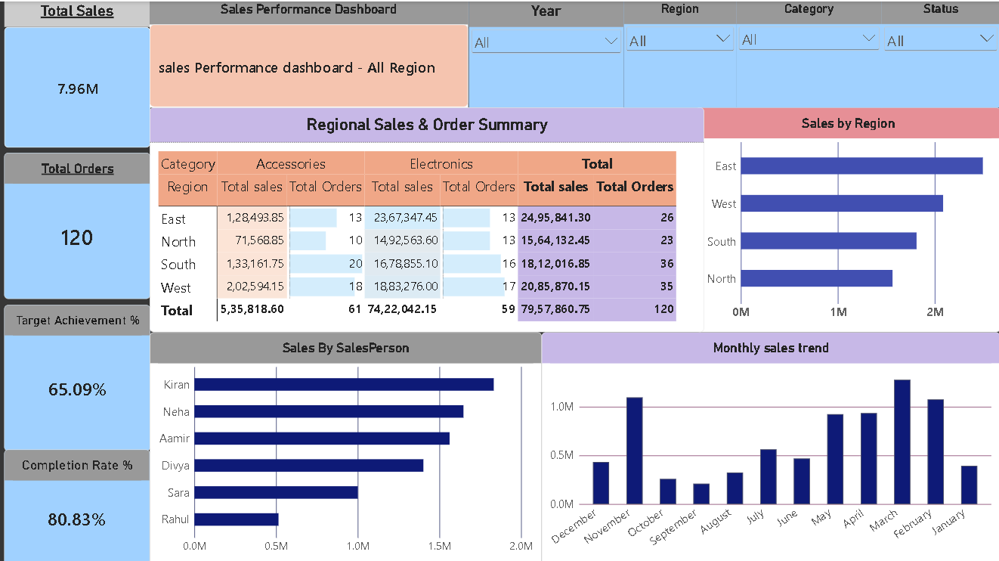
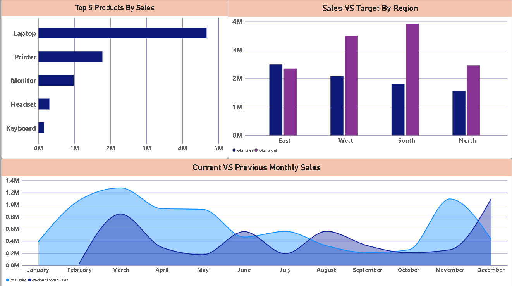

# Sales Performance Dashboard | Power BI

## 📊 Project Overview
This project is an interactive Power BI dashboard designed to analyze sales performance across regions, products, salespersons, and time periods.

The dashboard tracks key business KPIs such as total sales, order completion, target achievement, regional performance, and month-over-month sales trends.

## 🛠 Tools & Technologies
- Power BI
- DAX
- Power Query
- Microsoft Excel
- Data Modeling

## 📈 Key KPIs
- Total Sales
- Total Orders
- Target Achievement %
- Completion Rate %
- Total Target
- Previous Month Sales
- Month-over-Month Growth %

## 🔍 Dashboard Features
- Interactive Year, Region, Category, and Status filters
- Regional Sales & Order Summary
- Sales performance by Region
- Sales performance by Salesperson
- Monthly Sales Trend
- Top 5 Products by Sales
- Sales vs Target comparison
- Current vs Previous Month Sales analysis
- Conditional formatting
- Dynamic report title based on Region selection

## 🧮 DAX Measures Used

```DAX
Total Sales =
SUM(SalesDataTable[Sales_Amount])

Total Orders =
COUNT(SalesDataTable[Order_ID])

Completion Rate % =
DIVIDE(
    [Completed Orders],
    [Total Orders]
)

Target Achievement % =
DIVIDE(
    [Total Sales],
    [Total Target]
)

Previous Month Sales =
CALCULATE(
    [Total Sales],
    PREVIOUSMONTH(DateTable[Date])
)

MoM Growth % =
DIVIDE(
    [Total Sales] - [Previous Month Sales],
    [Previous Month Sales]
)
...

## 📸 Dashboard Preview

### Sales Performance Overview


### Product, Target & Monthly Analysis


## 💡 Key Insights

- East region generated the highest overall sales.
- Laptop was the highest-performing product by total sales.
- Regional performance showed differences between actual sales and assigned targets.
- Interactive filters allow analysis by Year, Region, Category, and Status.

## 📁 Project Files

- `Sales_Performance_Dashboard.pbix` — Power BI dashboard file
- `Sales_Data.xlsx` — Source dataset
- `Dashboard_page_1.png` — Main dashboard overview
- `Dashboard_page_2.png` — Additional sales analysis

## 👤 Author

**Yousuf Khan**

Data Analytics | Power BI | SQL | Excel
)

